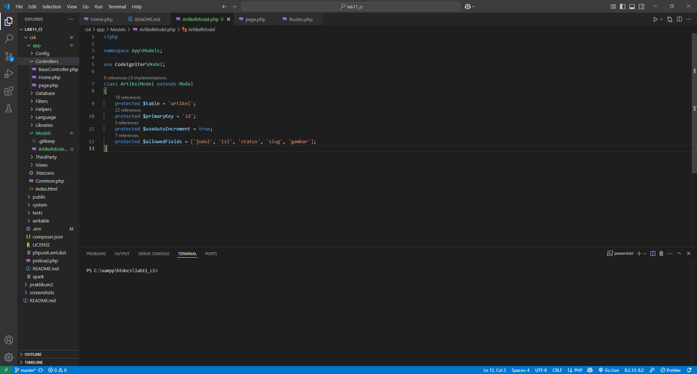
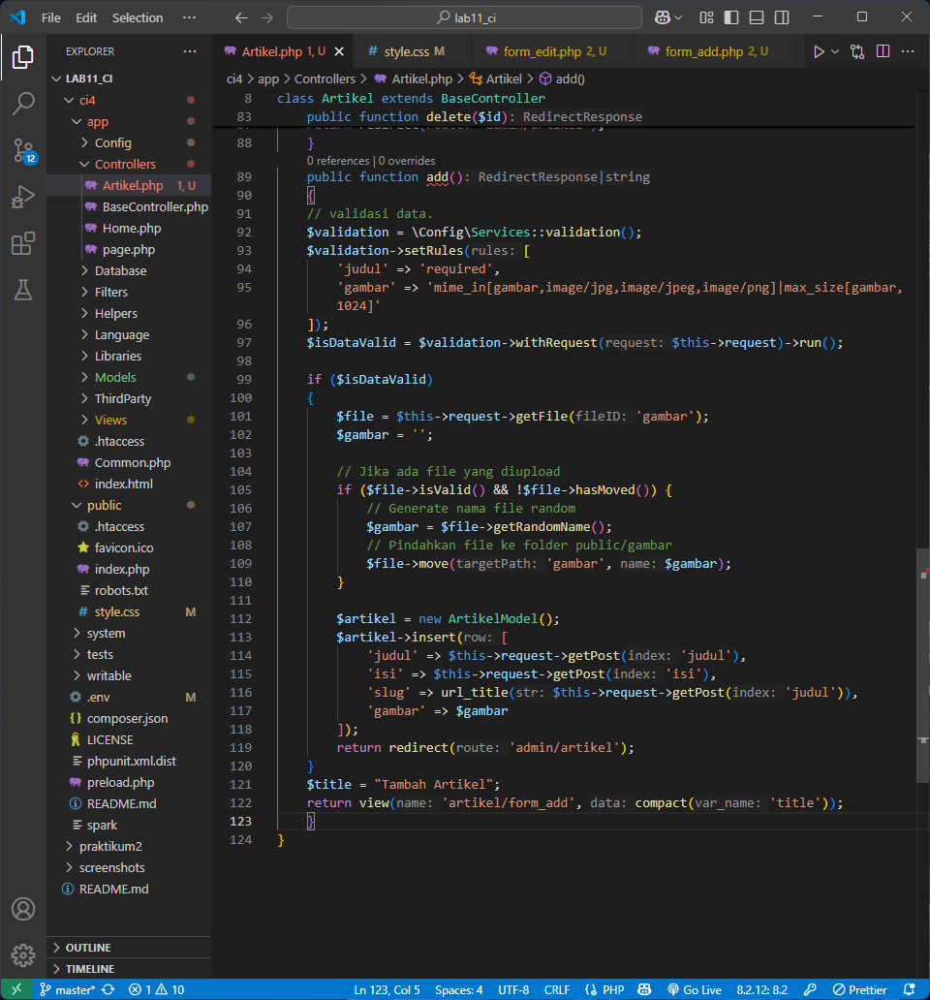

# Praktikum 1: PHP Framework (CodeIgniter)

## Langkah-langkah Praktikum

### 1. Persiapan

- Mengaktifkan ekstensi PHP yang dibutuhkan
  

### 2. Instalasi CodeIgniter 4

- Mengunduh dan mengekstrak CodeIgniter 4
  

### 3. Menjalankan CLI

- Menggunakan Command Line Interface
  

### 4. Mengaktifkan Mode Debugging

- Mengubah file env menjadi .env
  

### 5. Membuat Route Baru

- Menambahkan route di Routes.php
  

### 6. Membuat Controller

- Membuat file Page.php
  

### 7. Membuat View

- Membuat file about.php
  

### 8. Membuat Layout Web dengan CSS

- Membuat template header dan footer
  
  
  

## Pertanyaan dan Tugas

Saya telah melengkapi kode program untuk menu lainnya yang ada pada Controller Page, sehingga semua link pada navigasi header dapat menampilkan tampilan dengan layout yang sama.

- Halaman About
  

- Halaman Contact
  

- Halaman FAQ
  

- Halaman Terms of Service
  

- Modifikasi file page.php
  

## Hasil Akhir Praktikum 1

# Praktikum 2: Framework Lanjutan (CRUD)

## Langkah-langkah Praktikum

### 1. Membuat Database

- Membuat database lab_ci4 dan tabel artikel
  

### 2. Konfigurasi Koneksi Database

- Mengkonfigurasi file .env
  

### 3. Membuat Model

- Membuat file ArtikelModel.php
  

### 4. Membuat Controller

- Membuat file Artikel.php
  

### 5. Membuat View

- Membuat file index.php di folder artikel
  

### 6. Menambahkan Data Artikel

- Menambahkan data artikel melalui SQL
  

### 7. Membuat Tampilan Detail Artikel, Membuat Routing untuk artikel detail

- Membuat method view() di index.php dan file detail.php
  
  
  

### 8. Membuat Menu Admin

- Membuat method admin_index() dan file admin_index.php
  
  
  
  
  

### 9. Menambah Data Artikel

- Membuat method add() dan file form_add.php
  
  

### 10. Mengubah Data

- Membuat method edit() dan file form_edit.php
  
  

### 11. Menghapus Data

- Membuat method delete()
  

## Improvisasi yang Dilakukan

1. Menambahkan CSS untuk Admin Panel
   
2. Menambahkan Fitur Upload Gambar
   
3. Menambahkan Fitur Pencarian Artikel
   

## Hasil akhir Praktikum 2

