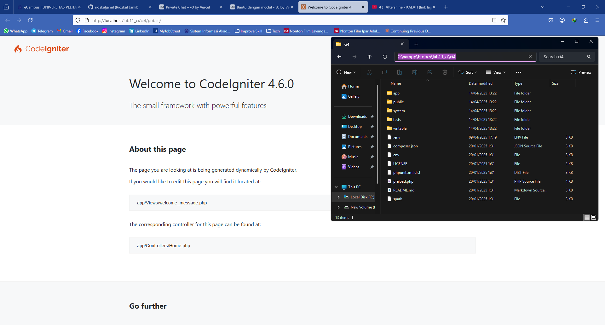
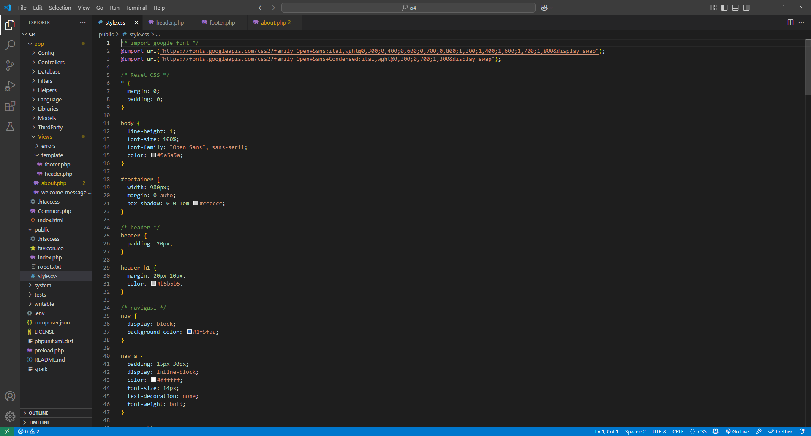

# Praktikum 1: PHP Framework (CodeIgniter)

## Langkah-langkah Praktikum

### 1. Persiapan

- Mengaktifkan ekstensi PHP yang dibutuhkan
  

### 2. Instalasi CodeIgniter 4

- Mengunduh dan mengekstrak CodeIgniter 4
  

### 3. Menjalankan CLI

- Menggunakan Command Line Interface
  

### 4. Mengaktifkan Mode Debugging

- Mengubah file env menjadi .env
  

### 5. Membuat Route Baru

- Menambahkan route di Routes.php
  

### 6. Membuat Controller

- Membuat file Page.php
  

### 7. Membuat View

- Membuat file about.php
  

### 8. Membuat Layout Web dengan CSS

- Membuat template header dan footer
  
  
  

## Pertanyaan dan Tugas

Saya telah melengkapi kode program untuk menu lainnya yang ada pada Controller Page, sehingga semua link pada navigasi header dapat menampilkan tampilan dengan layout yang sama.

- Halaman About
  

- Halaman Contact
  

- Halaman FAQ
  

- Halaman Terms of Service
  

- Modifikasi file page.php
  

- Hasil Akhir
  
