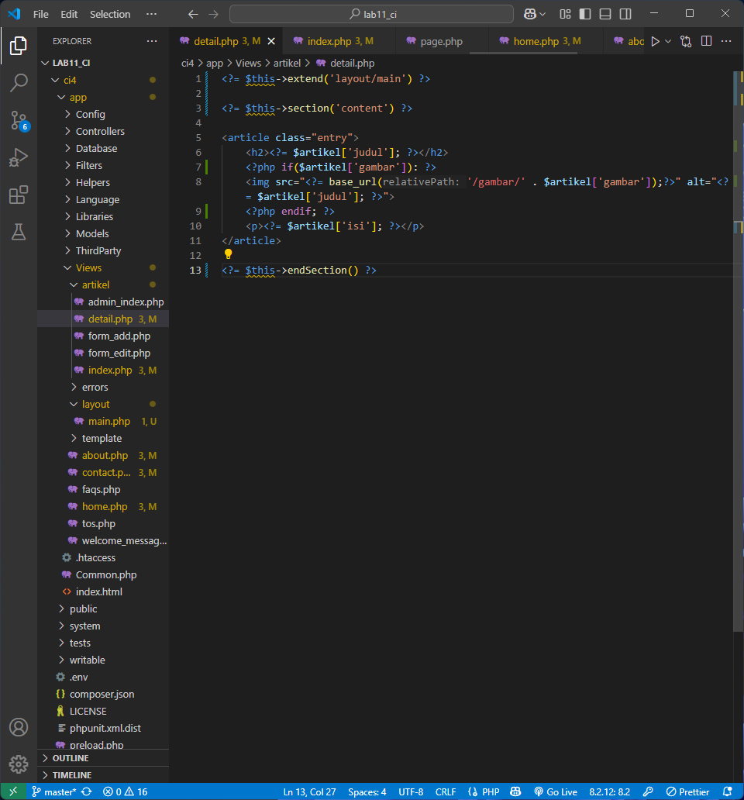
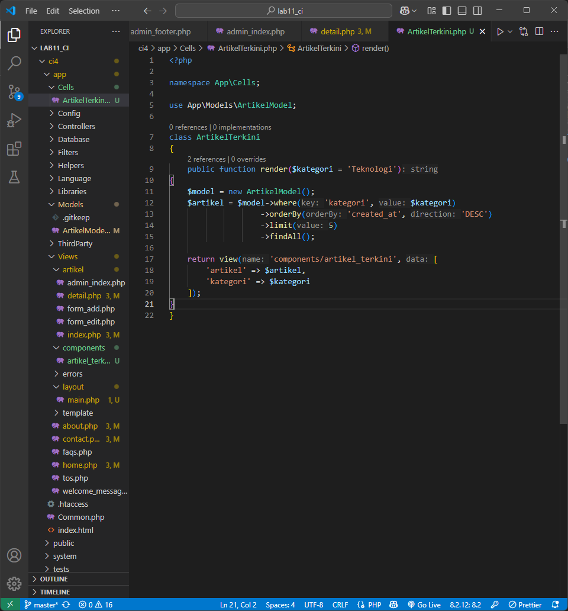
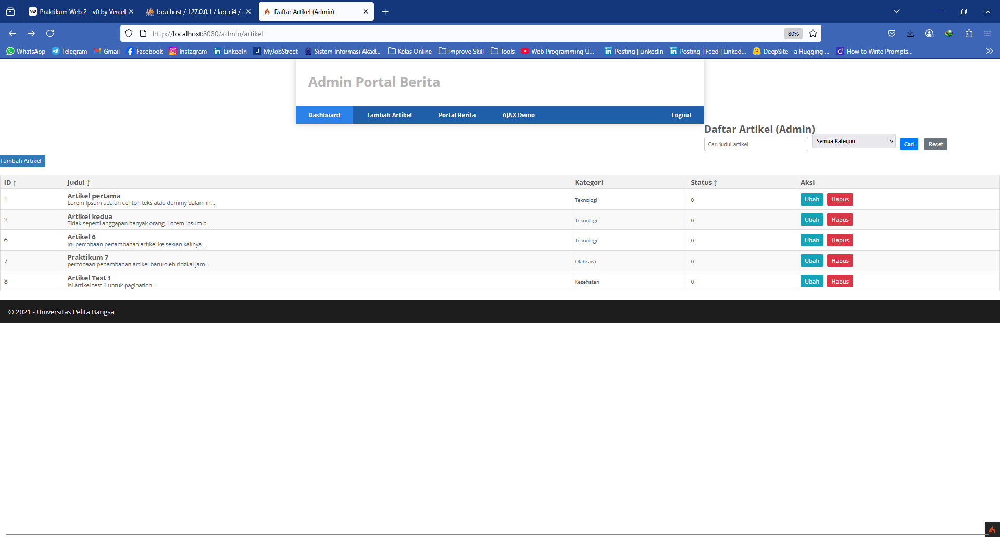
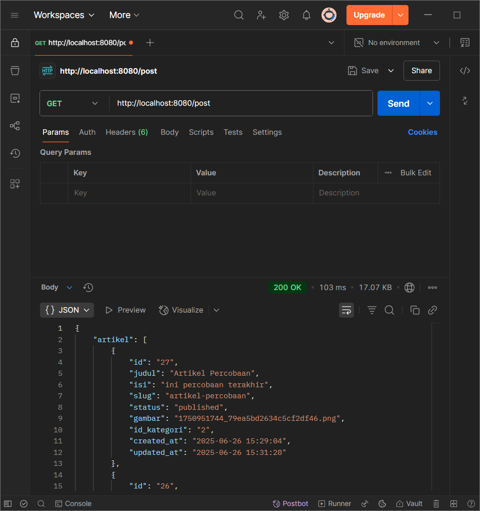

# Praktikum 1: PHP Framework (CodeIgniter)

## Langkah-langkah Praktikum

### 1. Persiapan

- Mengaktifkan ekstensi PHP yang dibutuhkan
  

### 2. Instalasi CodeIgniter 4

- Mengunduh dan mengekstrak CodeIgniter 4
  

### 3. Menjalankan CLI

- Menggunakan Command Line Interface
  

### 4. Mengaktifkan Mode Debugging

- Mengubah file env menjadi .env
  

### 5. Membuat Route Baru

- Menambahkan route di Routes.php
  

### 6. Membuat Controller

- Membuat file Page.php
  

### 7. Membuat View

- Membuat file about.php
  

### 8. Membuat Layout Web dengan CSS

- Membuat template header dan footer
  
  
  

## Pertanyaan dan Tugas

Saya telah melengkapi kode program untuk menu lainnya yang ada pada Controller Page, sehingga semua link pada navigasi header dapat menampilkan tampilan dengan layout yang sama.

- Halaman About
  

- Halaman Contact
  

- Halaman FAQ
  

- Halaman Terms of Service
  

- Modifikasi file page.php
  

## Hasil Akhir Praktikum 1


# Praktikum 2: Framework Lanjutan (CRUD)

## Langkah-langkah Praktikum

### 1. Membuat Database

- Membuat database lab_ci4 dan tabel artikel
  

### 2. Konfigurasi Koneksi Database

- Mengkonfigurasi file .env
  

### 3. Membuat Model

- Membuat file ArtikelModel.php
  

### 4. Membuat Controller

- Membuat file Artikel.php
  

### 5. Membuat View

- Membuat file index.php di folder artikel
  

### 6. Menambahkan Data Artikel

- Menambahkan data artikel melalui SQL
  

### 7. Membuat Tampilan Detail Artikel, Membuat Routing untuk artikel detail

- Membuat method view() di index.php dan file detail.php
  
  
  

### 8. Membuat Menu Admin

- Membuat method admin_index() dan file admin_index.php
  
  
  
  
  

### 9. Menambah Data Artikel

- Membuat method add() dan file form_add.php
  
  

### 10. Mengubah Data

- Membuat method edit() dan file form_edit.php
  
  

### 11. Menghapus Data

- Membuat method delete()
  

## Improvisasi yang Dilakukan

1. Menambahkan CSS untuk Admin Panel
   
2. Menambahkan Fitur Upload Gambar
   
3. Menambahkan Fitur Pencarian Artikel
   

## Hasil akhir Praktikum 2


# Praktikum 3: View Layout dan View Cell

## Langkah-langkah Praktikum

### 1. Membuat Layout Utama

- Membuat folder layout dan file main.php
  

### 2. Modifikasi File View

- Mengubah file home.php, about.php, contact.php, index.php, detail.php untuk menggunakan layout baru
  
  
  
  
  

### 3. Menambahkan Field Tanggal pada Database

- Menambahkan kolom created_at pada tabel artikel
  

### 4. Membuat Class View Cell

- Membuat folder Cells dan file ArtikelTerkini.php
  

### 5. Membuat View untuk View Cell

- Membuat folder components dan file artikel_terkini.php
  

### 6. Improvisasi - Menambahkan Kategori pada Artikel

- Menambahkan kolom kategori dan mengimplementasikan filter berdasarkan kategori
  
  
  
  
  

## Jawaban Pertanyaan

### 1. Apa manfaat utama dari penggunaan View Layout dalam pengembangan aplikasi?

Manfaat utama dari penggunaan View Layout dalam pengembangan aplikasi adalah:

1. **Konsistensi Tampilan**: View Layout memastikan semua halaman memiliki struktur dan tampilan yang konsisten.
2. **Pemisahan Konten dan Layout**: Memisahkan konten spesifik halaman dari struktur layout umum, sehingga kode lebih terorganisir.
3. **Penggunaan Kembali Kode (Reusability)**: Layout yang sama dapat digunakan oleh banyak halaman tanpa perlu menulis ulang kode.
4. **Pemeliharaan yang Lebih Mudah**: Perubahan pada layout cukup dilakukan di satu tempat dan akan berlaku untuk semua halaman yang menggunakannya.
5. **Pengembangan yang Lebih Cepat**: Pengembang dapat fokus pada konten halaman tanpa perlu mengulang-ulang kode layout.

### 2. Jelaskan perbedaan antara View Cell dan View biasa.

Perbedaan antara View Cell dan View biasa:

1. **Fungsi dan Tujuan**:

- **View Biasa**: Digunakan untuk menampilkan halaman lengkap atau bagian dari halaman.
- **View Cell**: Digunakan untuk membuat komponen UI yang dapat digunakan ulang dan bersifat modular.

2. **Cara Pemanggilan**:

- **View Biasa**: Dipanggil dengan `return view('nama_view', $data)` atau `echo view('nama_view', $data)`.
- **View Cell**: Dipanggil dengan `<?= view_cell('Namespace\\Class::method', $params) ?>`.

3. **Logika Bisnis**:

- **View Biasa**: Biasanya tidak memiliki logika bisnis, hanya menerima data dari controller.
- **View Cell**: Dapat memiliki logika bisnis sendiri, seperti mengambil data dari database.

4. **Penggunaan Kembali**:

- **View Biasa**: Dapat digunakan kembali dengan include/extend, tetapi kurang fleksibel.
- **View Cell**: Dirancang khusus untuk komponen yang digunakan berulang kali di berbagai halaman.

5. **Isolasi**:

- **View Biasa**: Berbagi konteks dengan view yang memanggilnya.
- **View Cell**: Memiliki konteks tersendiri, terisolasi dari view yang memanggilnya.

### 3. Ubah View Cell agar hanya menampilkan post dengan kategori tertentu.

- Modifikasi method `render()` di class `ArtikelTerkini` untuk menerima parameter kategori:
  
- Panggil View Cell dengan parameter kategori di layout:
  

## Hasil akhir Praktikum 3


# Praktikum 4: Framework Lanjutan (Modul Login)

## Langkah-langkah Praktikum

### 1. Membuat Tabel User

- Membuat tabel user di database lab_ci4
  

### 2. Membuat Model User

- Membuat file UserModel.php
  

### 3. Membuat Controller User

- Membuat file User.php dengan method login dan logout
  

### 4. Membuat View Login

- Membuat file login.php di folder user
  
  

### 5. Membuat Database Seeder

- Membuat UserSeeder untuk data dummy
  
  
  

### 6. Menambahkan Auth Filter

- Membuat file Auth.php di folder Filters
  
  
  

### 7. Menambahkan Fungsi Logout

- Menambahkan tombol logout
  

## Improvisasi yang Dilakukan

1. Menambahkan Halaman Register
   
   
   

2. Menambahkan Dashboard Admin
   
   
   
   

3. Memperbaiki tampilan dengan CSS
   

## Hasil Akhir Praktikum 4


# Praktikum 5: Pagination dan Pencarian

## Langkah-langkah Praktikum

### 1. Membuat Pagination

#### Modifikasi Controller Artikel dan View admin_index.php


### 2. Membuat Pencarian

#### Modifikasi method `admin_index` untuk menambahkan fitur pencarian dan link Pagination, lalu tambahkan form pencarian di View.


### 3. Melakukan Improvisasi yaitu : menambahkan fitur pencarian berdasarkan kategori, dan menampilkan jumlah data yang ditemukan.


### Hasil Akhir Praktikum 5.


# Praktikum 6: Upload File Gambar

## Langkah-langkah Praktikum

### 1. Modifikasi Method add() pada Controller Artikel

#### Modifikasi Controller Artikel


### 2. Modifikasi file form_add.php

#### Menambahkan field input dan sesuaikan tag form dengan menambahkan ecrypt type.


### 3. Ujicoba file upload dengan mengakses menu tambah artikel.


### Hasil Akhir Praktikum 6.


# Praktikum 7: Relasi Tabel dan Query Builder

## Tujuan

- Memahami konsep relasi antar tabel dalam database
- Mengimplementasikan relasi One-to-Many
- Melakukan query dengan join tabel menggunakan Query Builder
- Menampilkan data dari tabel yang berelasi

## Langkah-langkah Praktikum

### 1. Membuat Tabel Kategori

Saya membuat tabel kategori dengan struktur:

- id_kategori (INT, PRIMARY KEY, AUTO_INCREMENT)
- nama_kategori (VARCHAR 100)
- slug_kategori (VARCHAR 100)

```sql
CREATE TABLE kategori (
    id_kategori INT(11) AUTO_INCREMENT,
    nama_kategori VARCHAR(100) NOT NULL,
    slug_kategori VARCHAR(100),
    PRIMARY KEY (id_kategori)
);
```


### 2. Menambahkan Foreign Key ke Tabel Artikel

Saya menambahkan kolom id_kategori ke tabel artikel dan membuat foreign key constraint:

```sql
ALTER TABLE artikel
ADD COLUMN id_kategori INT(11),
ADD CONSTRAINT fk_kategori_artikel
FOREIGN KEY (id_kategori) REFERENCES kategori(id_kategori);
```


### 3. Membuat Model Kategori

Saya membuat KategoriModel.php untuk mengelola data kategori:


### 4. Memodifikasi Model Artikel

Saya menambahkan method getArtikelDenganKategori() untuk melakukan JOIN:


### 5. Memodifikasi Controller Artikel

Saya mengupdate controller untuk menggunakan relasi tabel:


### 6. Memodifikasi View

Saya mengupdate semua view untuk menampilkan kategori:


### 7. Testing

Hasil testing menunjukkan semua fitur berjalan dengan baik:


## Pertanyaan dan Tugas

### 1. Modifikasi tampilan detail artikel

Saya telah memodifikasi detail.php untuk menampilkan nama kategori artikel.

### 2. Menampilkan daftar kategori di halaman depan

Saya menambahkan widget kategori di sidebar.

### 3. Fungsi menampilkan artikel berdasarkan kategori

Saya membuat method kategori() di controller dan view kategori.php.

### Hasil Praktikum 7


# Praktikum 8: AJAX di CodeIgniter 4

## Langkah-langkah Praktikum

### 1. Menambahkan Pustaka jQuery

Saya menambahkan jQuery ke project dengan menyalin file jQuery ke folder `public/assets/js/`.


### 2. Membuat AJAX Controller

Saya membuat controller baru bernama `AjaxController.php` untuk menangani request AJAX.


### 3. Menambahkan Routes

Saya menambahkan routes untuk AJAX di `app/Config/Routes.php`.


### 4. Membuat View

Saya membuat view untuk menampilkan data artikel dengan AJAX.


### 5. Testing

Hasil testing menunjukkan semua fitur AJAX berjalan dengan baik

### 6. Improvisasi

Saya menambahkan fitur pencarian dan filter kategori dengan AJAX

## Pertanyaan dan Tugas

### 1. Menambahkan Fungsi Tambah dan Ubah Data

Saya telah menambahkan fungsi untuk menambah dan mengubah data artikel menggunakan AJAX.

### 2. Improvisasi

Saya menambahkan fitur pencarian dan filter kategori untuk meningkatkan fungsionalitas aplikasi.

## Hasil Praktikum 8


# Praktikum 9: Implementasi AJAX Pagination dan Search

## Langkah-langkah Praktikum

### 1. Persiapan Data

Saya menambahkan lebih banyak data artikel untuk testing pagination:


### 2. Modifikasi Controller Artikel

Saya mengupdate method admin_index() untuk mendukung AJAX request:


### 3. Modifikasi View admin_index.php

Saya mengubah view untuk menggunakan AJAX dengan fitur:

- Search real-time
- Filter kategori
- Pagination tanpa reload
- Sorting kolom


### 4. Testing Fitur

Hasil testing menunjukkan semua fitur AJAX berjalan dengan baik

## Pertanyaan dan Tugas

Saya mengimplementasikan sorting untuk kolom ID, Judul, dan Status.

## Hasil Praktikum 9

Praktikum ini berhasil mengimplementasikan AJAX pagination dan search yang meningkatkan user experience dengan:

- Tidak ada reload halaman
- Response yang cepat
- Interface yang responsif
- Fitur sorting dan export tambahan
  

# Praktikum 10: API

## Langkah-langkah Praktikum

### 1. Persiapan

Menginstall postman, membuat database dan mengatur konfigurasinya


### 2. Membuat REST Controller

- Membuat file `Post.php` di `app/Controllers` untuk menangani operasi CRUD.
- Kode controller: (lihat file `Post.php`).
  

### 4. Membuat Routing

- Menambahkan rute di `app/Config/Routes.php`:
  ```php
  $routes->resource('post');
  ```
  
- Memeriksa rute dengan perintah:
  ```bash
  php spark routes
  ```
  

### 5. Pengujian dengan Postman

- **Menampilkan semua data (GET)**:
  - URL: `http://localhost:8080/post`
    
- **Menambahkan data (POST)**:
  - URL: `http://localhost:8080/post`
  - Body: `judul=Artikel Baru&isi=Ini adalah isi artikel baru`
    
- **Menampilkan data berdasarkan ID (GET)**:
  - URL: `http://localhost:8080/post/1`
    
- **Mengubah data (PUT)**:
  - URL: `http://localhost:8080/post/2`
  - Body: `judul=Artikel Diubah&isi=Ini adalah isi artikel yang diubah`
    
- **Menghapus data (DELETE)**:
  - URL: `http://localhost:8080/post/2`
    

## Kesimpulan

Praktikum ini berhasil mengimplementasikan REST API dengan CodeIgniter 4 untuk operasi CRUD. API diuji menggunakan Postman, dan semua fungsi (GET, POST, PUT, DELETE) berjalan dengan baik.
